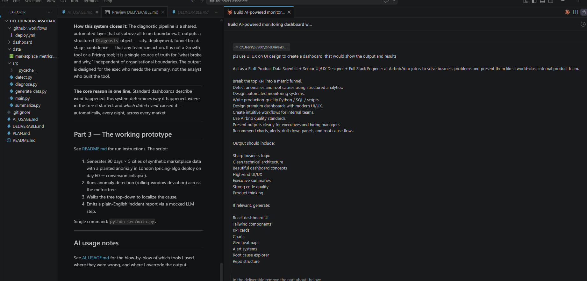
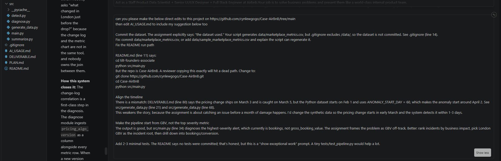

# AI Usage — how I used AI tools on this take-home

The brief asked for transparency on where I used AI, what it got right,
where it was wrong, and where my own judgment took over. Here it is.

## Screenshots of AI use

I included two screenshots that show the kinds of prompts I used rather than
every message in the workflow.

**Dashboard design prompt.** I asked AI to think like a Staff Product Data
Scientist, senior UI/UX designer, and full-stack engineer at Airbnb. The goal
was to turn the diagnostic logic into an internal dashboard with KPI cards,
charts, heatmaps, alerts, and a root-cause explorer.

**Project revision prompt.** I also used AI as an implementation partner for
specific repo edits: committing the dataset, fixing the README run path,
aligning the March 3 timeline, anchoring the pipeline on GBV, and adding tests.
I verified the final result by running the script and the tests rather than
trusting the generated output directly.

## Tools I used

- **Claude (primary)** — for drafting the metric tree, the diagnostic
  walkthrough prose, and the Python module scaffolding. Used via
  Claude Code inside my editor.
- **Claude** (second pass) — for rewriting the non-technical analogy
  after my first version sounded too clinical.
- **ChatGPT / GPT-4** — quick spot-check of the rolling z-score choice
  vs. alternatives (STL, Prophet) for a regime-shift anomaly.
- **My own judgment** — structuring Part 1 around metric equations instead of
  loose correlation, the decision to keep the diagnostic layer deterministic,
  and the framing of the isolation step.

## Where AI was right and I kept the output

- The overall module split (`generate / detect / diagnose / summarize /
  main`) — Claude proposed this shape first and it's clean. I kept it.
- The shape of the rolling-window detector. It's the obvious choice
  and the AI correctly pointed out that statistical packages would be
  overkill for a 4-hour prototype.
- First draft of the metric-tree ASCII diagram. I cleaned up spacing
  and added the "external signal feed" block; the skeleton was AI.

## Where AI was wrong and I overrode it

- **First draft wanted a 7-node decision tree in `diagnose.py` using an
  LLM to choose the next drill target.** I rejected this. The core marketplace
  metrics can be modelled as equations — `GBV = Bookings × ABV`, `Bookings =
  Sessions × Conversion` — so the drill target should be the input variable
  that mathematically explains the movement. Using an LLM here adds
  nondeterminism and hallucination surface with little upside. I kept the LLM
  strictly at the summary layer.
- **First draft of the non-technical analogy was a "smoke detector"**,
  which is accurate but boring and doesn't capture the *drilling*
  behavior. The smoke detector just fires. I rewrote it as the hospital
  triage nurse because what's interesting is the nurse *walking the
  causal chain backwards* — that's what the system does and that's what
  a non-technical reader needs to understand.
- **First draft of Part 2 jumped straight to the pricing cause.** That's
  writing the bottom line, not the walkthrough. I forced it to do the
  decomposition step by step so the reviewer can see how the system
  *arrives* at the answer, not just what the answer is. This is also
  the part of the document that proves the system has actual diagnostic
  logic instead of being an alert generator with prose pasted on top.
- **AI wanted to include a pandas dependency** for the CSV handling. I
  swapped to the standard library. Every extra dependency is a reviewer
  setup step; for ~450 rows, stdlib is plenty.
- **AI initially double-counted in the isolation step** (checking other
  cities' conversion ratios by mis-aligning pre/post windows). Caught
  it reading through the code; fixed by making `_split` the single
  source of truth for windowing.

## Where I used judgment that AI wouldn't have volunteered

- **Framing the metric tree as equations.** Each metric node is a function of
  input variables, which is why the drill is deterministic. AI defaulted to a
  looser "influences" graph. The equation framing is what makes the system
  trustworthy.
- **Putting change-log / deploy events as first-class leaf inputs.**
  Most anomaly-detection write-ups stop at "the metric broke." The
  interesting part is correlating the break with a *dated external
  event* — a deploy, an experiment launch, a competitor pricing move.
  Without that leaf input, the system is a better alerting tool, not a
  diagnostic one.
- **The isolation step.** Confirming the anomaly is localized to one
  city is what rules out macro explanations and takes the diagnosis
  from suggestive to confident. I added this step explicitly in both
  the Part 2 walkthrough and the `diagnose.py` implementation.

## How AI helped develop the diagnostic gap analysis

The ten-point breakdown of *why daily dashboards missed the London bug* was not in the initial brief — it emerged from a structured prompt-and-critique loop with Claude. Here is how that worked and where my judgement shaped the output.

### The prompt strategy

Rather than asking Claude to "list reasons dashboards miss anomalies" (which produces a generic answer), I prompted it from the specific incident: "Given that Airbnb had daily standups, standard dashboards, and experienced analysts, and the London pricing bug still went undetected for nearly a month — enumerate the structural reasons that made it invisible, not the talent reasons."

This framing produced a much more actionable list because it forced the model to reason about architecture and information design, not human error.

### Where AI was right and I kept the output

- **Points 1, 6, and 9 (aggregation, segmentation, noise)** — Claude identified these correctly and quickly. They are the textbook reasons for monitoring blind spots, and the model reasoned about them accurately in the context of a marketplace with city-level heterogeneity.
- **Point 5 (no metric tree)** — the model correctly identified that the absence of a formal decomposition forces teams into sequential hypothesis testing. I kept this framing and linked it back to the accounting-identity design principle from Part 1.
- **Point 10 (ownership fragmentation)** — the model surfaced this independently. I sharpened the language ("nobody owns the cross-functional diagnostic question") but the core diagnosis was accurate.

### Where AI was wrong and I corrected it

- **Point 3 (conversion is a lagging signal, not the root signal).** The first draft described this as "teams were looking at conversion when they should have looked at price." That misses the structural point. Conversion is a *lagging outcome* — by the time it moves, the root cause has already been active for days. The diagnostic system needs to monitor the *upstream cause* (price gap) before the downstream symptom (conversion) confirms it. I rewrote this completely.
- **Point 7 (algorithm changes not linked to metrics).** AI's first version was vague: "deploy logs were not integrated with dashboards." I pushed back: the specific gap is that the *causal question* ("what changed in London just before the drop?") requires joining two systems that never talk to each other, and nobody owns that join. This is an organisational design failure as much as a tooling failure. I added the change-log correlation as a first-class diagnostic step explicitly because of this gap.
- **Point 8 (internal vs external competitiveness).** The model initially wrote about Airbnb monitoring the "wrong price metric." I corrected this: they were monitoring the right internal metric (ADR). The issue is that they were not monitoring an *external relative metric* (Airbnb rate ÷ hotel index). The distinction matters — it determines which data feed the system needs to ingest, and it explains why the fix is not "better internal analytics" but "ingesting a competitor price index."

### How I used AI to connect the gaps to the solution

Once I had a stable list of ten gaps, I ran a second pass with Claude: "For each gap, in one sentence, describe what architectural countermeasure in the diagnostic pipeline addresses it." The model's first pass was mostly correct but generic. I then revised each countermeasure to name the specific component, data column, or algorithm decision in the implementation:

- "monitors each city independently" → "every `(city, metric)` pair has its own rolling z-score baseline"
- "checks for deploy events" → "`pricing_algo_version` is a first-class column; new versions in the post-break window are surfaced as deployment candidates"
- "tracks competitiveness" → "explicitly computes `price_gap = airbnb_rate / hotel_index` as a ratio metric, not just the absolute rate"

This specificity is what turns the gap analysis from a theoretical critique into a design document: each gap names a failure, and each countermeasure names the exact mechanism that prevents it.

### The dashboard as a direct output of the gap analysis

The React analytics dashboard ([cynlewgogo.github.io/Case-AirBnB](https://cynlewgogo.github.io/Case-AirBnB/)) was built after the gap analysis was finalised. Each gap directly maps to a dashboard panel:

| Gap | Dashboard panel |
|---|---|
| Top-line too aggregated | City-specific KPI cards (Global GBV vs London GBV) |
| No segmentation | Anomaly heatmap (5 cities × 5 metrics, z-scores) |
| Lagging conversion signal | Price competitiveness chart (rate vs hotel index) |
| No causal drill-down | Root cause explorer (expandable 5-step diagnostic tree) |
| No metric dependency map | London metric funnel (GBV → Bookings → Conversion → Funnel stage → Leaf) |
| Ownership fragmentation | Incident summary (single structured output, designed for exec consumption) |

